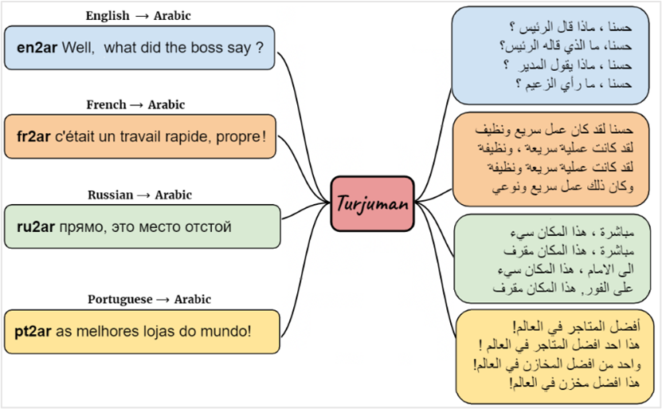

# Arabic-Machine-Translation (TURJUMAN)

  

TURJUMAN is a multilingual machine translation toolkit that uses the AraT5 model trained on the AraOPUS-20 dataset. It outperforms baselines on evaluation metrics like BLEU, METEOR, and TER.
## List of languages supported:
The supported languages for translation into Arabic using TURJUMAN are Arabic, Bulgarian, Bosnian, Czech, Danish, German, Greek, English, Spanish, French, Hindi, Italian, Korean, Polish, Portuguese, Russian, Turkish, Cebuano, Scots Gaelic, Tamashek, and Yoruba.

## Data:
The model has been trained using parallel data that is publicly available. The AraOPUS-20 dataset is used as a benchmark and is also included in the toolkit to evaluate the performance of Arabic machine translation models. However, the document does not provide any specific details regarding the datasets used in training TURJUMAN models.

## Example:
1.	Original (English): Hello, how are you?
   
    Translation (Arabic): مرحبا ، كيف حالك ؟

3.	Original (Spanish): ¿Hola, cómo estás?
   
    Translation (Arabic): مرحبا ، كيف حالك ؟

5.	Original (Korean): 안녕하세요. 어떻게 지내세요?
   
    Translation (Arabic): حسنا ، ما هي المشكلة ؟

7.	Original (Bulgarian): Здравей, как си?
   
    Translation (Arabic): مرحبا ، كيف حالك ؟

9.	Original (Greek): Γεια πώς είσαι?
    
    Translation (Arabic): مرحبا ، كيف حالك ؟

11.	Original (Danish): Hej, hvordan går det?
    
    Translation (Arabic): مرحبا ، كيف حالك ؟

13.	Original (Russian): Привет, как дела?
    
    Translation (Arabic): مرحبا ، كيف حالك ؟

15.	Original (Hindi): नमस्ते, आप कैसे हैं?
    
    Translation (Arabic): مرحبا ، كيف حالك ؟

## 	Conclusion:
The TURJUMAN toolkit is a comprehensive set of tools and resources designed for neural machine translation from 20 different languages to Modern Standard Arabic. It employs the state-of-the-art AraT5 model, which is a text-to-text Transformer model, as the core translation engine, allowing for more accurate and efficient language translation.

## 	Reference:
1.	https://arxiv.org/pdf/2206.03933v1.pdf
2.	https://turjuman.readthedocs.io/en/latest/
3.	https://huggingface.co/UBC-NLP/turjuman
4.	https://github.com/ubc-nlp/turjuman
5.	https://shorturl.at/dlFK8
 
  
